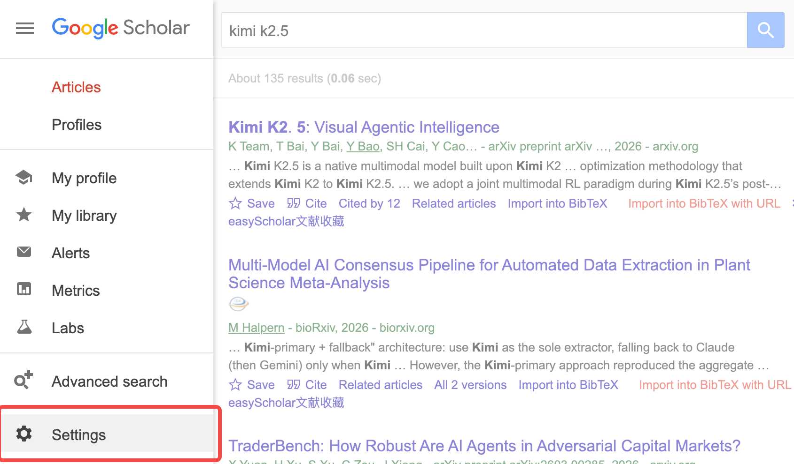
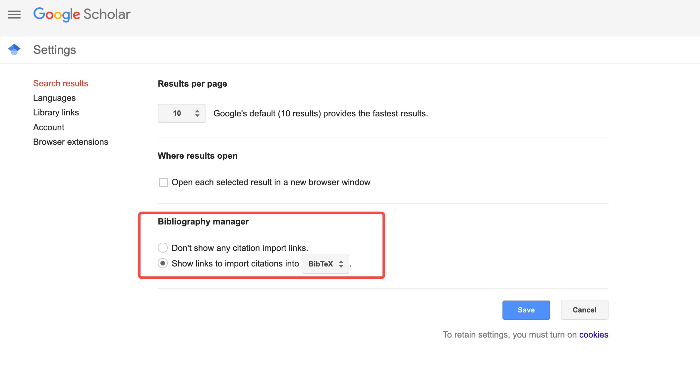
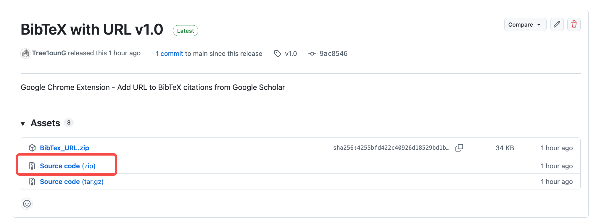
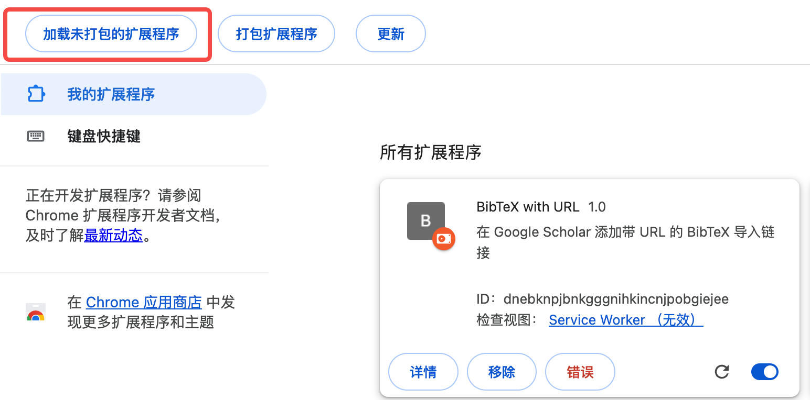
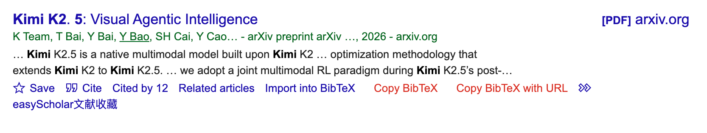
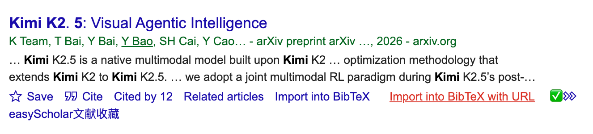

# BibTeX with URL

Chrome 扩展 - 在 Google Scholar 一键复制带 URL 的 BibTeX 引用

## 功能

- 在 Google Scholar 每篇论文下方添加 "Import into BibTeX with URL" 链接
- 点击即可复制完整的 BibTeX 引用，包含论文 URL
- 复制成功显示 ✅ 提示

## 安装方法

### 方法一：从 Release 下载（推荐）

1. 下载最新版本的 ZIP 文件：[source_code.zip](https://github.com/YAI-Lab/BibTex_URL/releases/latest)
2. 解压 ZIP 文件
3. 打开 Chrome，访问 `chrome://extensions/`
4. 开启右上角的「开发者模式」
5. 点击「加载已解压的扩展程序」
6. 选择解压后的文件夹





### 方法二：从源码安装

1. 克隆或下载本仓库
2. 打开 Chrome，访问 `chrome://extensions/`
3. 开启右上角的「开发者模式」
4. 点击「加载已解压的扩展程序」
5. 选择本仓库文件夹

## 使用方法

1. 访问 [Google Scholar](https://scholar.google.com/)
2. 搜索论文
3. 在论文下方找到红色的 "Import into BibTeX with URL" 链接



4. 点击即可复制带 URL 的 BibTeX 到剪贴板
5. 复制成功会显示 ✅







## 示例

```
@article{chen2025pass,
  title={Pass@ k training for adaptively balancing exploration and exploitation of large reasoning models},
  author={Chen, Zhipeng and Qin, Xiaobo and Wu, Youbin and Ling, Yue and Ye, Qinghao and Zhao, Wayne Xin and Shi, Guang},
  journal={arXiv preprint arXiv:2508.10751},
  year={2025},
  url={https://arxiv.org/abs/2508.10751}
}
```

## 更新日志

- v1.0: 初始版本
